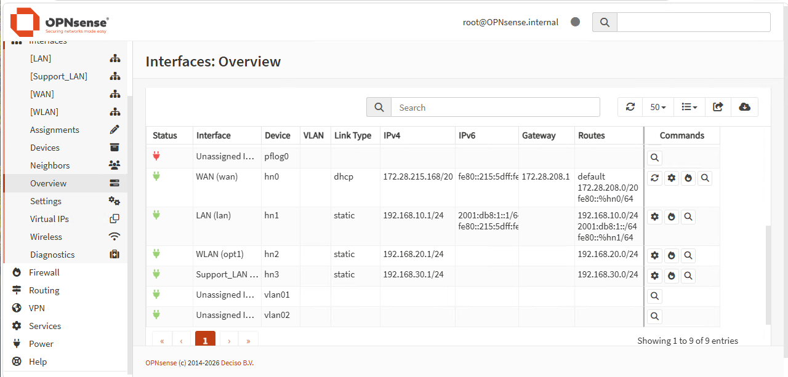
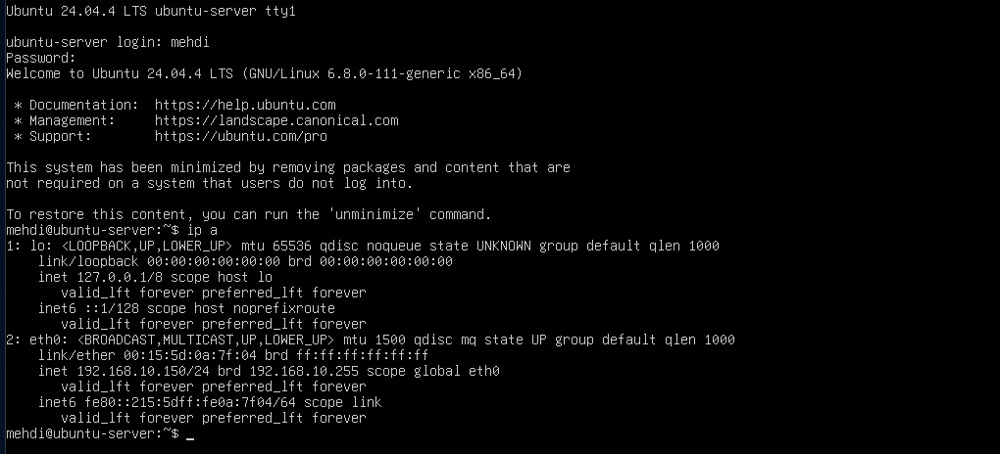
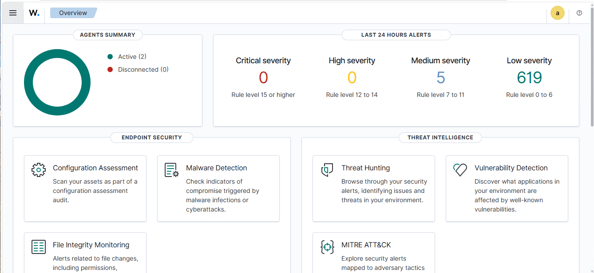
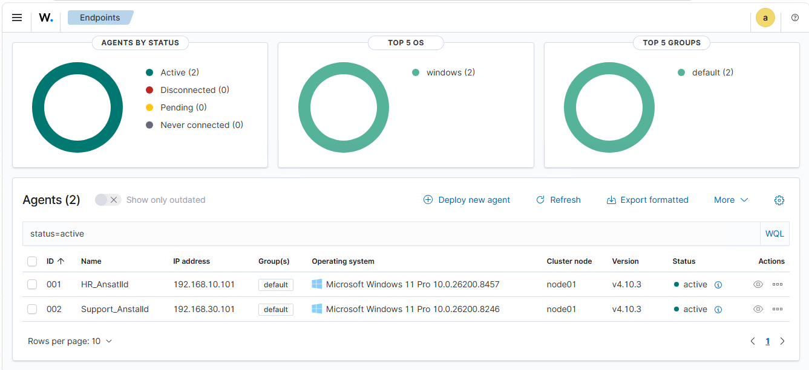
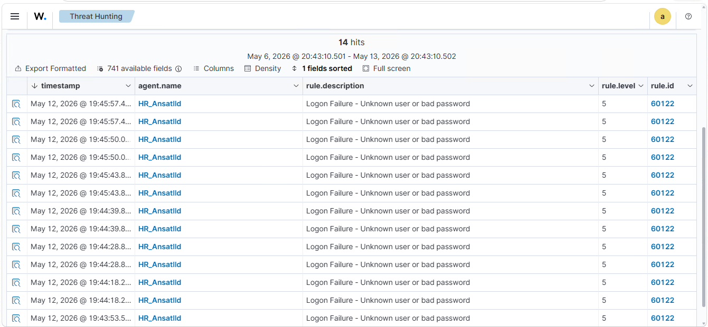
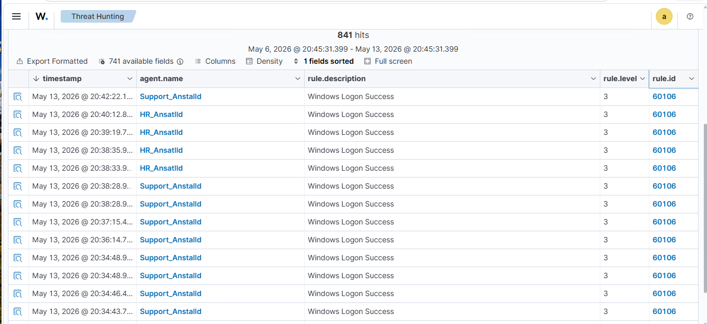
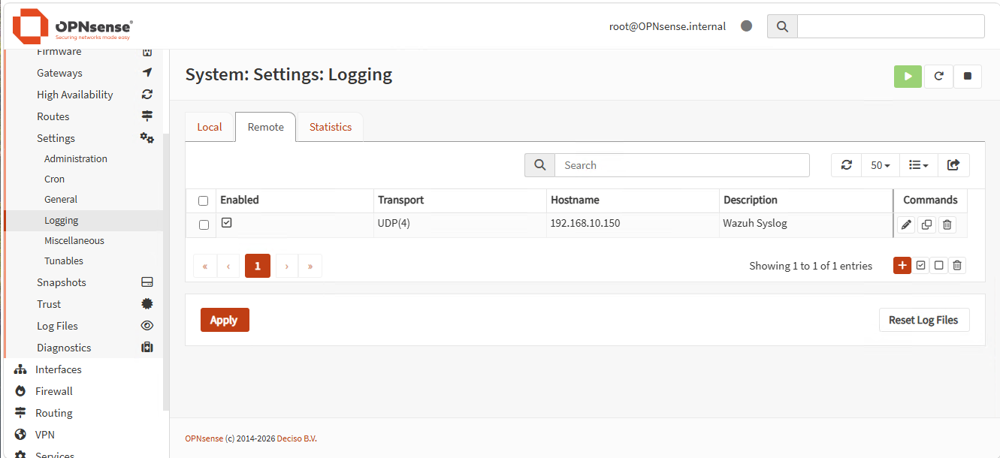
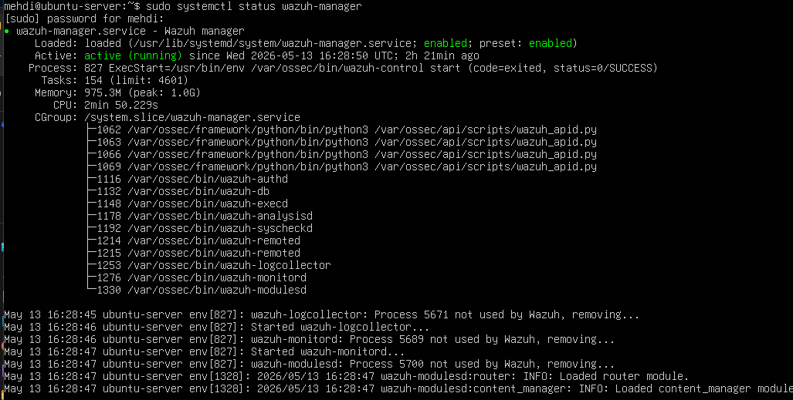
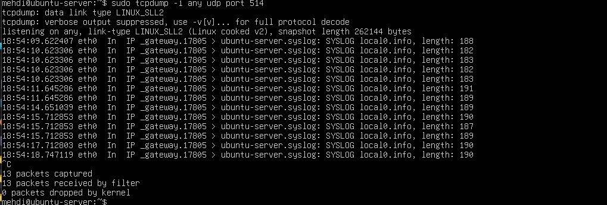
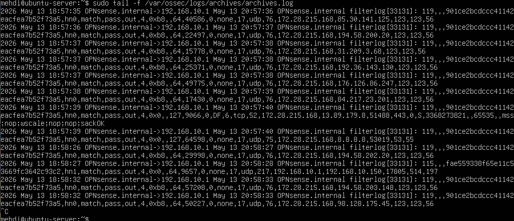

# OPNsense Wazuh Threat Monitoring Lab

## Overview

This project documents a hands-on Blue Team lab where I deployed Wazuh as a SIEM and endpoint monitoring platform inside a virtualized Hyper-V environment.

The lab combines OPNsense firewall logging, Windows endpoint monitoring, Wazuh agents, syslog forwarding, authentication event analysis, and threat hunting. The focus was not only to install tools, but also to verify that logs actually moved through the environment and could be used for security monitoring.

The lab was based on a medium-sized company scenario with separate network segments for HR and Support. The environment was adapted to my existing Hyper-V and OPNsense lab setup.

All testing was performed in an isolated local lab environment for educational and defensive security purposes only.

---

## Lab Objective

The main objective of this lab was to understand how Wazuh can strengthen network defense by complementing vulnerability scanning with real-time monitoring and log analysis.

The lab focused on:

- Deploying Wazuh Server on Ubuntu Server
- Installing Wazuh agents on Windows endpoints
- Monitoring Windows authentication events
- Detecting failed login attempts
- Simulating brute force activity
- Simulating suspicious login activity
- Forwarding OPNsense logs to Wazuh using syslog
- Verifying syslog traffic with tcpdump
- Troubleshooting Wazuh log ingestion
- Reviewing events in Wazuh Threat Hunting
- Understanding why some alerts require custom rules or tuning

---

## Lab Environment

| System | Role | IP Address | Network |
|---|---|---:|---|
| OPNsense | Firewall / Gateway | 192.168.10.1 | LAN |
| Wazuh_Server | Wazuh Manager / Dashboard | 192.168.10.150 | LAN |
| HR_Client | Windows endpoint / HR user | 192.168.10.101 | LAN |
| Support_Client | Windows endpoint / Support user | 192.168.30.101 | Support_LAN |

---

## Network Segments

| Network | Purpose | Gateway |
|---|---|---:|
| 192.168.10.0/24 | Main LAN / HR / Wazuh Server | 192.168.10.1 |
| 192.168.30.0/24 | Support network | 192.168.30.1 |

The original assignment used a slightly different IP plan, but the lab was adapted to fit my existing Hyper-V and OPNsense environment. The core security goals were kept the same: segmentation, endpoint monitoring, firewall logging, and centralized analysis through Wazuh.

---

## Tools and Technologies

| Tool / Technology | Purpose |
|---|---|
| Hyper-V | Virtualization platform |
| OPNsense | Firewall, gateway, and syslog source |
| Ubuntu Server | Operating system for Wazuh Server |
| Wazuh | SIEM, endpoint monitoring, and threat detection |
| Windows 11 | HR and Support endpoint clients |
| PowerShell | Wazuh agent installation |
| Command Prompt | Login and traffic simulation |
| Syslog | Log forwarding from OPNsense to Wazuh |
| tcpdump | Verification of incoming syslog traffic |
| Wazuh Threat Hunting | Event analysis and alert review |
| Linux CLI | Server configuration and troubleshooting |

---

## Network Topology

<pre>
                         Hyper-V Lab Environment

                                 Internet
                                    |
                              Default Switch
                                    |
                              OPNsense Firewall
                              192.168.10.1
                                    |
          -------------------------------------------------
          |                                               |
      LAN-Switch                                  Support_LAN_Switch
   192.168.10.0/24                                192.168.30.0/24
          |                                               |
          |                                               |
   ----------------------                         -------------------
   |                    |                         |
Wazuh_Server        HR_Client                Support_Client
192.168.10.150      192.168.10.101           192.168.30.101
Wazuh SIEM          HR endpoint               Support endpoint
</pre>

---

## Implementation Summary

### 1. Hyper-V Preparation

The existing Hyper-V environment was reviewed and organized for the lab.

The virtual machines were renamed or organized with clearer names:

| VM Name | Purpose |
|---|---|
| OPNsense_Firewall | Firewall and gateway |
| Wazuh_Server | Wazuh SIEM server |
| HR_Client | Windows HR endpoint |
| Support_Client | Windows Support endpoint |

Existing virtual switches were reused where possible instead of creating unnecessary new switches. This made the lab more realistic because the configuration had to be adapted to an existing environment.

---

### 2. OPNsense Network Configuration

OPNsense was used as the firewall and gateway between the lab networks.

The main LAN was used for HR and Wazuh:

<pre>
LAN: 192.168.10.1/24
</pre>

The Support network was configured as:

<pre>
Support_LAN: 192.168.30.1/24
</pre>

The Support interface was verified as active and reachable.

---

### 3. Wazuh Server Configuration

Ubuntu Server was used as the Wazuh server.

The Wazuh server was configured with a static IP address:

<pre>
IP address: 192.168.10.150
Subnet mask: 255.255.255.0
Gateway: 192.168.10.1
DNS: 8.8.8.8 / 1.1.1.1
</pre>

Connectivity was verified with:

<pre>
ping 192.168.10.1
ping 8.8.8.8
</pre>

Both tests were successful.

---

### 4. Wazuh Installation

Wazuh was installed using the automated installation script:

<pre>
sudo apt update
sudo apt install -y curl
curl -sO https://packages.wazuh.com/4.10/wazuh-install.sh
sudo bash wazuh-install.sh -a
</pre>

During the first installation attempt, Wazuh reported that the VM did not meet the recommended minimum hardware requirements.

The VM resources were adjusted to:

<pre>
Memory: 4096 MB
Processors: 2 virtual CPUs
</pre>

After increasing the resources, the installation completed successfully.

The Wazuh dashboard was accessed through:

<pre>
https://192.168.10.150
</pre>

The generated admin password from the installation was used. An attempt to change the built-in admin password from the dashboard failed because the admin user was reserved in this Wazuh version, so the generated password was kept for the lab.

---

### 5. Wazuh Agent Deployment

Wazuh agents were deployed through the Wazuh dashboard using the "Deploy new agent" option.

The HR endpoint was configured as:

<pre>
Agent name: HR_Anstalld
IP address: 192.168.10.101
Wazuh Server: 192.168.10.150
</pre>

The Support endpoint was configured as:

<pre>
Agent name: Support_Anstalld
IP address: 192.168.30.101
Wazuh Server: 192.168.10.150
</pre>

The generated PowerShell installation command was executed as Administrator on each Windows client.

The agent service was started with:

<pre>
NET START WazuhSvc
</pre>

Both agents were confirmed as active in the Wazuh dashboard.

---

## Threat Simulation and Detection

### 1. Brute Force Login Simulation

Failed login attempts were simulated on the HR client.

The current Windows user was checked with:

<pre>
whoami
</pre>

Observed user:

<pre>
desktop-th2mb3n\mehdi
</pre>

Failed login attempts were generated with:

<pre>
runas /user:mehdi cmd
</pre>

Several incorrect passwords were entered to simulate brute force behavior.

Wazuh detected the failed login attempts in Threat Hunting.

| Field | Result |
|---|---|
| Agent | HR_Anstalld |
| Rule description | Logon Failure - Unknown user or bad password |
| Rule ID | 60122 |
| Rule level | 5 |

This confirmed that Wazuh was able to detect failed authentication activity from the Windows endpoint.

---

### 2. Successful Login Monitoring

Successful login activity was observed from the Support client.

| Field | Result |
|---|---|
| Agent | Support_Anstalld |
| Rule description | Windows Logon Success |
| Rule ID | 60106 |
| Rule level | 3 |

This confirmed that Wazuh was collecting Windows authentication events from the Support endpoint.

---

### 3. Suspicious Login Simulation

A suspicious login scenario was simulated by changing the time zone on the Support client to:

<pre>
(UTC+08:00) Beijing, Chongqing, Hong Kong, Urumqi
</pre>

After changing the time zone, the user logged out and logged in again.

Wazuh generated a successful login event:

<pre>
Windows Logon Success
Rule ID: 60106
</pre>

No country or geolocation alert was generated. This was expected because the lab used private internal IP addresses, such as:

<pre>
192.168.30.101
</pre>

Private lab IP addresses do not provide real public geolocation data.

---

### 4. High Traffic / DDoS Simulation

High ICMP traffic was simulated from the HR client against OPNsense.

Command used:

<pre>
ping 192.168.10.1 -t -l 65500
</pre>

The goal was to simulate abnormal network activity and test whether Wazuh would generate a DDoS-style alert.

A dedicated DDoS alert was not triggered automatically by the default Wazuh rules. This showed that specific DDoS-style detection may require additional parsing, custom rules, or more advanced network telemetry.

This was still a useful part of the lab because it showed the difference between generating traffic and creating reliable SIEM detections.

---

## OPNsense Syslog Integration

OPNsense was configured to forward logs to Wazuh using remote syslog.

| Setting | Value |
|---|---|
| Transport | UDP |
| Destination | 192.168.10.150 |
| Port | 514 |
| Description | Wazuh Syslog |
| Log source | OPNsense firewall/syslog |

On the Wazuh server, syslog reception was configured in:

<pre>
/var/ossec/etc/ossec.conf
</pre>

Final syslog listener configuration:

<pre>
&lt;remote&gt;
  &lt;connection&gt;syslog&lt;/connection&gt;
  &lt;port&gt;514&lt;/port&gt;
  &lt;protocol&gt;udp&lt;/protocol&gt;
  &lt;allowed-ips&gt;192.168.10.1&lt;/allowed-ips&gt;
  &lt;local_ip&gt;0.0.0.0&lt;/local_ip&gt;
&lt;/remote&gt;
</pre>

After editing the configuration, Wazuh Manager was restarted:

<pre>
sudo systemctl restart wazuh-manager
</pre>

The service status was checked with:

<pre>
sudo systemctl status wazuh-manager
</pre>

Result:

<pre>
active (running)
</pre>

---

## Troubleshooting Summary

A major part of this lab was troubleshooting the OPNsense to Wazuh syslog integration.

The main issue was that OPNsense was sending syslog traffic, but the logs were not immediately visible in Wazuh.

Troubleshooting steps included:

- Checking the Wazuh ossec.conf configuration
- Fixing XML structure issues
- Removing incorrectly placed closing ossec_config lines
- Restarting Wazuh Manager after each change
- Verifying service status with systemctl
- Installing and using tcpdump
- Confirming that UDP 514 traffic arrived from OPNsense
- Enabling Wazuh archive logging
- Reviewing raw logs in archives.log

Syslog traffic was verified with:

<pre>
sudo tcpdump -i any udp port 514
</pre>

This confirmed that OPNsense was sending syslog traffic to the Wazuh server.

Archive logging was enabled by changing:

<pre>
&lt;logall&gt;no&lt;/logall&gt;
&lt;logall_json&gt;no&lt;/logall_json&gt;
</pre>

to:

<pre>
&lt;logall&gt;yes&lt;/logall&gt;
&lt;logall_json&gt;yes&lt;/logall_json&gt;
</pre>

Raw logs were monitored with:

<pre>
sudo tail -f /var/ossec/logs/archives/archives.log
</pre>

After this change, OPNsense firewall logs appeared in archives.log.

Final verified log path:

<pre>
OPNsense → Syslog UDP 514 → Wazuh Server → archives.log
</pre>

---

## Key Findings

| Area | Result |
|---|---|
| Wazuh installation | Successful after increasing VM resources |
| Wazuh dashboard | Accessible from Windows client |
| HR agent | Active |
| Support agent | Active |
| Failed login detection | Successful |
| Successful login monitoring | Successful |
| Suspicious login simulation | Login event detected |
| Geolocation alert | Not triggered due to private lab IPs |
| OPNsense syslog forwarding | Successful after troubleshooting |
| tcpdump verification | Confirmed UDP 514 traffic |
| archives.log validation | Confirmed raw OPNsense logs |
| DDoS simulation | Traffic generated, but no default DDoS alert triggered |

---

## Screenshots

### 1. OPNsense Interface Overview

OPNsense interface overview showing the LAN, WLAN, WAN, and Support_LAN interfaces. The main LAN uses `192.168.10.1/24`, and the Support_LAN segment uses `192.168.30.1/24`.

---

### 2. Wazuh Server Static IP

Ubuntu Server network configuration showing the Wazuh server using the static IP address `192.168.10.150/24` on the LAN network.

---

### 3. Wazuh Dashboard Overview

Wazuh dashboard overview showing active agents and alert statistics, confirming that the Wazuh web interface is working.

---

### 4. Wazuh Agent Summary

Wazuh endpoint summary showing both Windows agents, `HR_Anstalld` and `Support_Anstalld`, connected and active.

---

### 5. HR Failed Login Events

Threat Hunting view showing multiple failed login events from `HR_Anstalld`, detected as `Logon Failure - Unknown user or bad password` with rule ID `60122`.

---

### 6. Support Login Success Events

Threat Hunting view showing successful Windows logon events from `Support_Anstalld`, detected with rule ID `60106`.

---

### 7. OPNsense Syslog Target

OPNsense remote logging configuration showing syslog forwarding to the Wazuh server at `192.168.10.150` over UDP.

---

### 8. Wazuh Manager Status

Wazuh Manager service status showing `active (running)`, confirming that Wazuh accepted the configuration and is running correctly.

---

### 9. tcpdump Syslog Verification

tcpdump output showing incoming UDP 514 syslog traffic from OPNsense to the Wazuh server, confirming that syslog packets reach the server.

---

### 10. archives.log Verification

Wazuh `archives.log` output showing raw OPNsense firewall logs, confirming that syslog data is received and written by Wazuh.

---

## What I Learned

Through this lab, I practiced how SIEM and endpoint monitoring fit into a broader Blue Team workflow.

Key takeaways:

- Wazuh can centralize endpoint and security event monitoring
- Windows agents provide useful authentication visibility
- Failed login attempts can be detected and reviewed in Threat Hunting
- Successful logins can also be useful for investigation and timeline building
- OPNsense can forward firewall logs to Wazuh using syslog
- Syslog troubleshooting requires both sender-side and receiver-side validation
- tcpdump is useful for confirming whether logs actually reach the server
- archives.log is useful for validating raw log ingestion
- Default SIEM rules do not always generate the exact alert expected
- Custom rules and parser tuning may be needed for specific detections
- DDoS-style detection often requires more than simple ping traffic
- Troubleshooting is a major part of real SOC and Blue Team work
- A SIEM is most valuable when combined with log analysis, validation, and context

---

## Key Skills Demonstrated

- SIEM deployment
- Wazuh installation and configuration
- Endpoint monitoring
- Windows event log analysis
- Authentication event monitoring
- Brute force detection
- OPNsense syslog forwarding
- Firewall log analysis
- Linux server configuration
- tcpdump-based troubleshooting
- Wazuh archive log validation
- Threat Hunting
- Network segmentation
- SOC and Blue Team methodology
- Troubleshooting under realistic lab conditions

---

## Documentation

Full lab documentation is available here:

[Lab Documentation](docs/lab-documentation.md)

---

## Author

Muhammad Mehdi  
IT Security Developer Student
